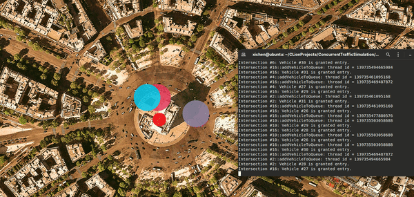

# Concurrent Traffic Simulation

## Description


This tool is a traffic simulator. A proper and thread-safe communication protocol is used between vehicles and intersections to complete the simulation.

The project uses the knowledge of concurrent programming in C++, namely mutexes, locks and message queues, to implement the traffic lights and integrate them properly into the code base.



## Usage
### Dependencies
* cmake >= 2.8
* make >= 4.1
* OpenCV >= 4.1
* gcc/g++ >= 5.4

### Clone the repository

```
git clone https://github.com/xichen-de/ConcurrentTrafficSimulation.git
```

### Build and compile

To compile the project, first, create a `build` directory and change to that directory:

```
mkdir build && cd build
```

### Run the program

The executable will be placed in the `build` directory. From within `build`, you can run the project as follows:

```
./traffic_simulation
```
